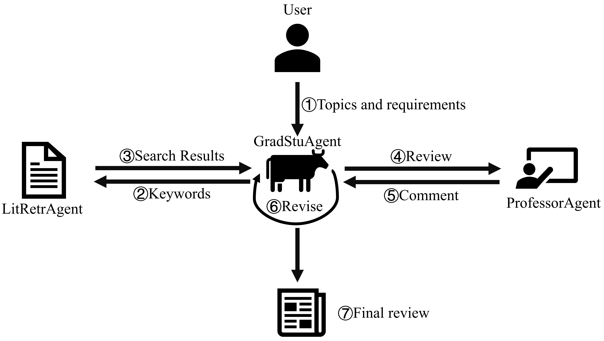

# 🚧 Full Code Coming Soon （项目仍在更新迭代中）

  
   
  <b>Figure 1.</b> AutoReview workflow.

---

## 🧩 项目迭代记录

### 🚀 第一版存在的问题

1. **模块化设计不足**  
   整体架构较为耦合，项目的可扩展性较低。

2. **工具定义方式不稳定**  
   直接在 Prompt 中定义外部工具，导致模型输入缺乏一致性和可维护性。

3. **多 Agent 协作方式复杂**  
   以 “Agent 互为工具” 的方式实现协作，虽然功能可行，但扩展性较差，并且增加了上下文管理的复杂度。

---

### 🔧 第二版的改进方向

1. **更高的模块化设计**  
   重新梳理 Agent 架构，使各模块职责更加清晰，便于功能扩展与替换。

2. **标准化工具定义**  
   采用 OpenAI 的 *function calling* 标准来定义 Agent 的外部工具接口，保证调用过程稳定、规范。

3. **独立式多 Agent 协作**  
   各 Agent 独立运行，通过较为统一的环境感知机制实现多 Agent 的协作，从而降低上下文依赖、提升系统灵活性。
